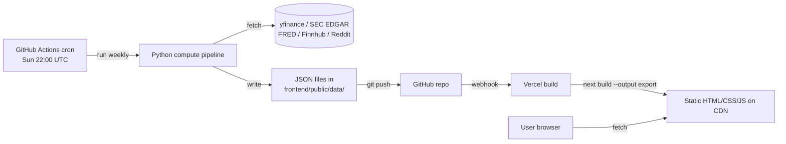

# QuantRank

> **Open-source US equity stock ranking — fundamental, technical, factor, sentiment, and ML signals combined into a single 0–100 composite StockRank, refreshed weekly.**

QuantRank is a static web app. A Python pipeline runs in GitHub Actions on a
weekly cron, computes scores for the S&P 500, and writes JSON files into the
repo. A Next.js static site reads those JSON files at build time and is served
from Vercel's free tier. No backend. No database. No live API calls from the
browser.

---

## ⚠️ Disclaimer — please read

**QuantRank is for educational and research purposes only.**

- Nothing here is investment advice, a recommendation, or an offer to buy or sell securities.
- Scores and "fair prices" are model outputs derived from public data. They can be wrong, stale, or misleading.
- **Do not use these scores for real-money trading decisions.**
- Past performance does not predict future results.
- The author is not a registered investment adviser.
- This project does not connect to a brokerage and never will.

If you're not comfortable losing 100% of any capital you might allocate based
on quantitative models, do not use this app for investing.

---

## Architecture

**Why this design (Option D — static site):**
- **Free forever**: public GitHub repo = unlimited Actions minutes; Vercel hobby tier = unlimited static hosting.
- **One system to debug**: only the Python script + the GitHub Actions logs.
- **Fast for users**: pre-computed JSON served via CDN — no DB queries, no rate limits.
- **Reproducible**: every score is tied to a git commit.

This is **not** a FastAPI/Flask backend, **not** a database, and **not** a
live-data system. See `SKILL.md` for the full architecture rules.

---

## Tech stack

| Layer | Tool |
|---|---|
| Compute language | Python 3.11+ |
| Compute runtime | GitHub Actions (`ubuntu-latest`) |
| Frontend framework | Next.js 14 (App Router, static export) |
| Styling | Tailwind CSS |
| Charts | Recharts |
| Data storage | JSON files in `frontend/public/data/` |
| Hosting | Vercel (frontend) + GitHub (data) |
| Free data sources | yfinance, edgartools, fredapi, finnhub-python, PRAW |
| ML | LightGBM + SHAP (Phase 5+) |

---

## Setup

You don't need to run anything locally. The whole app builds in CI.

1. **Push** this repo to GitHub as a **public** repository.
2. **Connect Vercel**:
   - vercel.com → "Add New Project" → import the repo.
   - Framework preset: **Next.js**.
   - Root directory: `frontend`.
   - Build command: `npm run build`.
   - Output directory: `out`.
   - Production branch: `main`.
   - Click Deploy.
3. **Trigger first compute** (after Phase 1 lands): GitHub → Actions → "Compute Rankings" → "Run workflow".
4. **Done.** From now on, every Sunday at 22:00 UTC the pipeline refreshes the JSON, commits it, and Vercel auto-deploys.

### Required GitHub secrets — by phase

| Phase | Secret | Why |
|---|---|---|
| 0 | _none_ | Stub workflow only |
| 1 | _none_ | yfinance + Wikipedia are unauthenticated |
| 2 | `EDGAR_USER_AGENT` | SEC requires `"<Your Name> <email>"` for EDGAR access |
| 4 | `FINNHUB_API_KEY`, `REDDIT_CLIENT_ID`, `REDDIT_CLIENT_SECRET`, `REDDIT_USER_AGENT` | News + Reddit sentiment |
| 6 | `FRED_API_KEY` | Macro / regime detection |

Add secrets at: **Repo → Settings → Secrets and variables → Actions → New repository secret**.

---

## Project status

See [`PHASE_STATUS.md`](./PHASE_STATUS.md) for the current build phase and
acceptance checklist.

## Methodology

See [`docs/METHODOLOGY.md`](./docs/METHODOLOGY.md) for the user-facing
methodology summary, and [`stock_ranking_knowledge.md`](./stock_ranking_knowledge.md)
for the full formula reference (~1600 lines covering fundamental, technical,
factor, sentiment, ML, regime, and validation techniques).

Architecture rules: [`SKILL.md`](./SKILL.md) and [`docs/ARCHITECTURE.md`](./docs/ARCHITECTURE.md).
Phase-by-phase build plan: [`WORKFLOW.md`](./WORKFLOW.md).

---

## License

MIT — see [`LICENSE`](./LICENSE).
