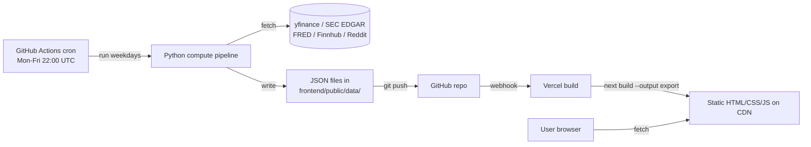

# Architecture — Static Site (Option D)

QuantRank has no backend server and no runtime database. The full pipeline:

## What this gives us

- **$0/month forever** on a public repo (free unlimited GitHub Actions + free Vercel hobby).
- **Fast UX** — pre-computed JSON, served from a CDN.
- **One system to debug** — the Python script. CI logs are the source of truth.
- **Reproducible** — every score is tied to a git commit.

## What we explicitly avoid

- ❌ FastAPI / Flask / Express runtime servers
- ❌ PostgreSQL / SQLite / MongoDB at runtime
- ❌ Live API calls from the browser
- ❌ Computing scores on user request
- ❌ Real-time / intraday refresh

If a feature requires any of the above, it doesn't fit QuantRank's
architecture. See `SKILL.md` "Anti-Patterns to Refuse".

## JSON contract

The compute and frontend are decoupled by the JSON files in
`frontend/public/data/`:

- `metadata.json` — version, last update, universe, run id.
- `rankings.json` — array of ranked stocks (summary).
- `stocks/{TICKER}.json` — full per-ticker detail.

Schemas live in `compute/output/schemas.py` (Pydantic) and must mirror
`frontend/lib/types.ts` (TypeScript). The full example schema is in
`SKILL.md` under "JSON Output Schema".
